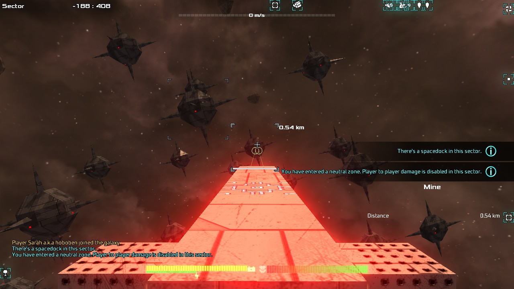

# Tao - Total Avorion Overhaul

**STATUS:** left a bit broken but probably a day away from release!

Tao is a work-in-progress total-conversion mod for [Avorion](https://store.steampowered.com/app/445220/Avorion/).

**It's "headline features" are:**

* less overwhelming loot system
* galaxy & combat overhaul
* massively better performance
* quality of life improvements

**What to expect**

* a fun sandbox experience
* a reasonably balanced "1.0"-quality release.

**What not to expect**

* Any story, or tutorial. Play the original first!
* Multiplayer hasn't been tested at all.

Features
----

* **inventory**
   - less focus on managing heaps of random loot
   - reduced trading goods from more than 150 to less than 50.
   - fewer weapons and subsystems, but with clearer roles
   - no randomised weapon or system bonuses or variants
   - main progression is material & rarity

* **performance**
  - **all around fewer stutters, better framerates, and shorter loading screens**
  - plan cache system
  - optimised asteroid plan generation speed
  - fixed and improved wreckage cleanup script
  - some expensive shaders simplified
  - salvaged and mined materials appear directly in cargo bay if possible rather than becoming entities
  - no more fighter spam
  - fewer asteroids, but arranged in a way that *feels* much denser

* **combat**
  - fewer guns with clearer roles
  - fun coaxial weapons from the start
  - slowly-rotating main guns for battleship style combat
  - no "accumulatingBlockHealth" - [ships can now be broken in half]([https://www.reddit.com/r/avorion/comments/o8bnst/my_most_complex_centrally_armored_ships_this/](https://www.reddit.com/r/avorion/comments/o8bnst/my_most_complex_centrally_armored_ships_this/h36f99e/))
  - vastly reduced turret slots, but...
    - weapons don't take up more slots as they get bigger
    - so you have fewer weapons
    - but as you progress those weapons can get bigger and better

* **story**
   - blank slate with existing story removed completely
   - may be extended by other mods in future
 
 * **overhaul**
   - completely new goods, systems, weapons, stations, events, sectors, etc.
   - completely new station founding mechanic
   - pirates only attack outer sectors
   - no Xsotan :p
  
 * **new features**
   - proximity mines
     
 * **quality of life enhancements**
   - hidden stashes can now be interacted with at transporter range
   - some Avorion bug fixes

Known Issues
------------

### Can't refine newly mined ores or salvaged scrap in inventory

Workaround: ores and scrap can be refined normally once you travel to a different sector or reload a saved game.

### Can't sell newly purchased equipment back to spacedock

Close the spacedock dialog then open it again. The sell tab will now be populated properly.

### Additional damage resistance shows as a weakness instead

This is merely a cosmetic issue with Avorion. Rest assured that weapons testing has verified that the resistance is still applied as intended.

Roadmap
-------

### Short term

* Fix station founding.
* Add NPC traders to plan cache system.
* Prepare for version 1.0 Steam workshop release!

### Medium term

* Balance pass
* Additional subsystems
* Additional sector types
* Additional events
* Player-deployed mines
* Sector anomalies
* Combat ship size variety
* Plan cache eviction for stale entries
* Additional NPC weapon types & torpedos (slow rate of fire ones only for performance)
* Reintroduce captains and AI orders

### Long term

* Factions overhaul
* Diplomacy overhaul
* Galaxy shape overhaul
* Textures and shaders overhaul
* Sound effects overhaul
