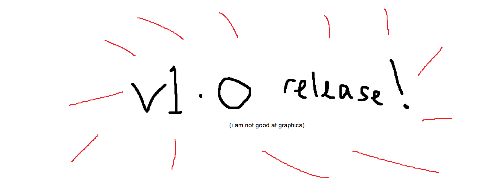

# Tao - Total Avorion Overhaul

Tao is a total-conversion mod for [Avorion](https://store.steampowered.com/app/445220/Avorion/).

**It's "headline features" are:**

* less overwhelming loot system
* galaxy & combat overhaul
* massively better performance
* quality of life improvements

**What to expect**

* a fun sandbox experience
* a reasonably balanced "1.0"-quality release.

**What not to expect**

* Any story, or tutorial. Play the original first!
* Multiplayer hasn't been tested at all.

Features
----

* **inventory**
   - less focus on managing heaps of random loot
   - reduced trading goods from more than 150 to less than 50.
   - fewer weapons and subsystems, but with clearer roles
   - no randomised weapon or system bonuses or variants
   - main progression is material & rarity

* **performance**
  - **all around fewer stutters, better framerates, and shorter loading screens**
  - plan cache system
  - optimised asteroid plan generation speed
  - fixed and improved wreckage cleanup script
  - some expensive shaders simplified
  - salvaged and mined materials appear directly in cargo bay if possible rather than becoming entities
  - no more fighter spam
  - fewer asteroids, but arranged in a way that *feels* much denser

* **combat**
  - fewer guns with clearer roles
  - fun coaxial weapons from the start
  - slowly-rotating main guns for battleship style combat
  - no "accumulatingBlockHealth" - [ships can now be broken in half]([https://www.reddit.com/r/avorion/comments/o8bnst/my_most_complex_centrally_armored_ships_this/](https://www.reddit.com/r/avorion/comments/o8bnst/my_most_complex_centrally_armored_ships_this/h36f99e/))
  - vastly reduced turret slots, but...
    - weapons don't take up more slots as they get bigger
    - instead, each type of weapon takes up a specific number of slots (e.g. artillery cannons take 4, dirsuptors take 2, autocannon takes 1...)
    - so you have fewer weapons
    - but as you progress those weapons can get bigger and better

* **story**
   - blank slate with existing story removed completely
   - may be extended by other mods in future
 
 * **overhaul**
   - completely new goods, systems, weapons, stations, events, sectors, etc.
   - completely new station founding mechanic
   - pirates only attack outer sectors
   - no Xsotan :p
  
 * **new features**
   - proximity mines
     
 * **quality of life enhancements**
   - hidden stashes can now be interacted with at transporter range
   - some Avorion bug fixes
   - refining is instant - no more waiting at refineries

Known Issues
------------

### Can't sell newly purchased equipment back to spacedock

Close the spacedock dialog then open it again. The sell tab will now be populated properly.

### Spacedocks not able to build ships

Exit to your drone with T and build by pressing B.

However, you will have a lack of starting crew.

Current workaround for that is to build a second small ship that has enough starting crew to be manouverable and use that as a crew shuttle.

### Additional damage resistance shows as a weakness instead (can't fix)

This is merely a cosmetic issue with Avorion. Rest assured that weapons testing has verified that the resistance is still applied as intended.

FAQ
---

### How do I get past the center barrier?

Wormholes can now pass through the barrier.

### How do I found a new station?

Open the player menu with P and go to the new station founding tab.

### How do I get more building resources / how do I refine ores and scrap?

Go to an ore processor for ores, and a recycling station for scrap.

### How do I report a bug or make a suggestion?

Please feel free to make a [GitHub issue](https://github.com/golightlyb/tao/issues) or [comment on the Steam workshop page!](https://steamcommunity.com/sharedfiles/filedetails/?id=3007442662)

### Can I support the project?

Yes!

* Graphics - can you make promotional graphics e.g. a logo for the mod? Can you make models that can appear in the universe?
* Video making - can you make a video of you playing the mod?
* Financial - v1.0 was a month-long side-project. Can you [sponsor me](https://github.com/sponsors/golightlyb) montly or as a once-off for future work?
* Programming - pull requests are welcome! (I'll actually unzip the files at some point; I don't normally develop on Windows so don't have git installed...)
* Social - tell your friends! :)

Copying
-------

See [LICENSE.txt](./LICENSE.txt) but basically you can do whatever you want as long as you keep the credit.

Roadmap
-------

Released!!! 🎉

### Short term

* **PRIORITY** more sector types (that one big asteroid ring is getting old!!!)
* Reintroduce captains and AI orders

### Medium term

* Balance pass
* Additional subsystems
* Additional sector types
* Additional events
* Player-deployed mines
* Sector anomalies
* More combat variety
* Plan cache eviction for stale entries
* Additional NPC weapon types & torpedos (slow rate of fire ones only for performance)

### Long term

* Factions overhaul
* Diplomacy overhaul
* Galaxy shape overhaul
* Textures and shaders overhaul
* Sound effects overhaul
